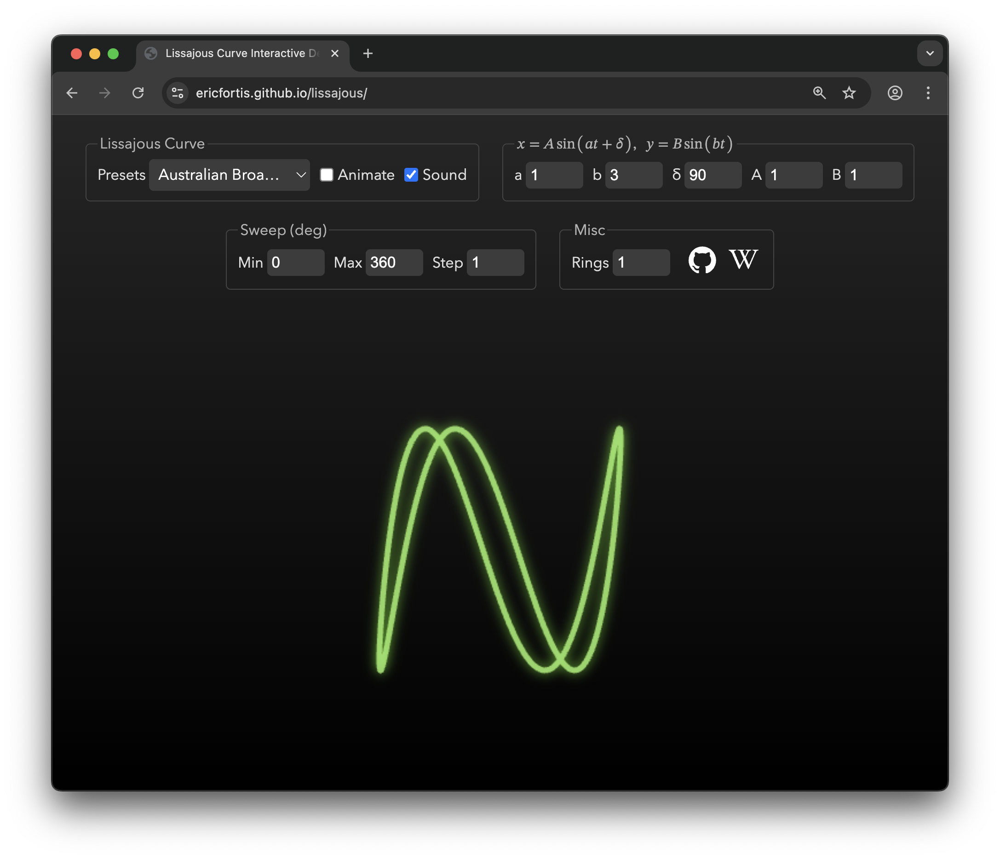

# Lissajous Curve Interactive Demo

Lissajous curves are looping patterns formed by plotting two sine waves at right angles.

<math>
    <mi>x</mi><mo>=</mo><mi>A</mi><mspace width="2px"/><mi>sin</mi><mo>⁡</mo><mo>(</mo><mi>a</mi><mi>t</mi><mo>+</mo><mi>δ</mi><mo>)</mo>
</math>,
<math>
    <mi>y</mi><mo>=</mo><mi>B</mi><mspace width="2px"/><mi>sin</mi><mo>⁡</mo><mo>(</mo><mi>b</mi><mi>t</mi><mo>)</mo>
</math>

 

This program lets you explore them interactively: adjust parameters,
visualize musical intervals, and hear the frequency ratio.

## 🎵 Sound

Since Lissajous curves reflect the ratio between two sine waves, we can
visualize **musical intervals** — which are two notes played together.

This demo lets you hear those intervals while seeing their shape.
We use 220 Hz (A3) as the base frequency (`a = 1`). For example, a
**perfect fifth** (3:2 ratio) plays A4 (440 Hz) and E5 (~660 Hz).

So yes, you can hear what Meta’s logo might sound like.

## 🔗 https://ericfortis.github.io/lissajous

 

## License

[MIT](LICENSE) © 2024 Eric Fortis
